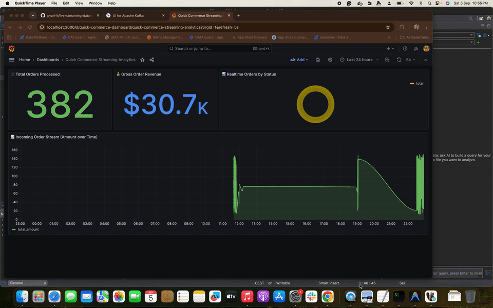
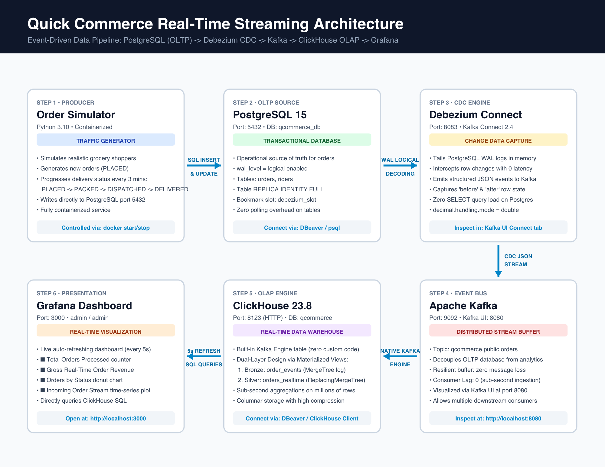
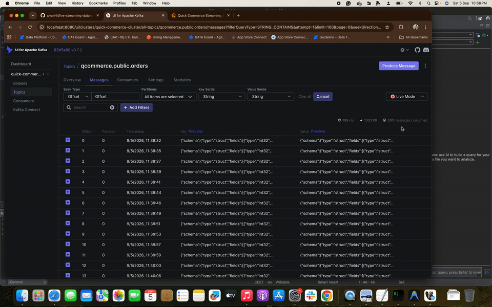

# Quick Commerce Real-Time Streaming Data Pipeline

A production-grade, end-to-end real-time streaming data pipeline demonstrating how high-velocity platforms move data from **OLTP $\rightarrow$ CDC $\rightarrow$ Kafka $\rightarrow$ OLAP $\rightarrow$ Live Dashboard** in sub-seconds.



---

## 🎯 What We Are Achieving

In high-velocity **Quick Commerce** (10-minute grocery delivery services like Zepto, Blinkit, or Instacart), operational decisions cannot wait for hourly or nightly batch ETL:
* **The Challenge**: Traditional batch pipelines introduce hours of delay. When order volumes suddenly spike, delivery SLAs are breached, or riders get stuck, business operators find out far too late.
* **The Architecture Solution**: An event-driven, sub-second streaming architecture:
  1. **Zero-Lag Event Capture**: Listens to PostgreSQL's Write-Ahead Log (WAL) via **Debezium CDC**, capturing every status transition the exact millisecond it commits without impacting OLTP database performance.
  2. **High-Throughput Message Streaming**: Buffers and distributes ordered event streams through **Apache Kafka**.
  3. **Real-Time Columnar OLAP**: ClickHouse continuously ingests the stream via its native Kafka Engine with a **Dual-Layer architecture** (immutable audit log + deduplicated live state).
  4. **Live Operational Dashboard**: Auto-refreshing **Grafana** dashboard monitoring live order throughput, status lifecycles, and gross revenue in real time.

---

## 🏗️ Architecture & Data Flow



> 📄 **High-Resolution PDF Blueprint**: [architecture_diagram.pdf](architecture_diagram.pdf)

```
[1. Simulator]  --->  [2. PostgreSQL (OLTP)]
                             | (WAL Logs)
                             v
                      [3. Debezium (CDC)]
                             | (JSON Events)
                             v
                      [4. Apache Kafka] (Topic: qcommerce.public.orders)
                             | (Kafka Engine)
                             v
                      [5. ClickHouse (OLAP)]
                             | (SQL Queries)
                             v
                      [6. Grafana Dashboard]
```

---

## 🚀 Quick Start (Pause & Resume)

Everything runs inside Docker.

* **Start all services**:
  ```bash
  docker compose start
  ```
* **Stop all services (pause & save battery)**:
  ```bash
  docker compose stop
  ```

---

## 🧭 End-to-End Walkthrough (In Order of Data Flow)

Follow the data step-by-step from left to right:

---

### Step 1: The Simulator (Traffic Generator)
* **What it does**: Simulates mobile app users placing grocery orders and delivery riders updating their status (`PLACED` $\rightarrow$ `PACKED` $\rightarrow$ `DISPATCHED` $\rightarrow$ `DELIVERED`).
* **Code**: Located in `simulator/simulator.py`.
* **How to control it**:
  * **Start traffic**: `docker start qcommerce_simulator`
  * **Stop traffic**: `docker stop qcommerce_simulator`
  * **Watch live orders**: `docker logs -f qcommerce_simulator`

---

### Step 2: PostgreSQL (OLTP Database)
* **What it does**: The operational relational database storing the source of truth (`orders` and `riders` tables). It has **Logical Replication (`wal_level=logical`)** enabled, writing every change into its internal Write-Ahead Log (WAL).
* **How to view it**:
  * **Via DBeaver**:
    * **Host**: `localhost` | **Port**: `5432`
    * **Database**: `qcommerce_db` | **User**: `postgres` | **Password**: `postgres`
  * **Via Terminal**:
    ```bash
    docker exec -it qcommerce_postgres psql -U postgres -d qcommerce_db -c "SELECT order_id, order_status, total_amount, updated_at FROM orders ORDER BY order_id DESC LIMIT 5;"
    ```

---

### Step 3: Debezium (Change Data Capture)
* **What it does**: Instead of running slow polling queries like `SELECT * FROM orders`, Debezium reads PostgreSQL's **Write-Ahead Log (WAL)** directly. The millisecond a transaction commits, Debezium captures the change and converts it into a structured event.
* **Replication Slot**: Postgres uses `debezium_slot` as a bookmark so no changes are lost.
* **How to verify it**:
  ```bash
  curl -s http://localhost:8083/connectors/quick-commerce-connector/status
  ```

---

### Step 4: Apache Kafka & Kafka UI (Event Message Bus)
* **What it does**: Decouples the transactional database from analytics. Debezium produces events into the Kafka topic **`qcommerce.public.orders`**.
* **How to view it visually (Kafka UI)**:
  1. Open your browser: **[http://localhost:8080](http://localhost:8080)**
  2. Click **Topics** $\rightarrow$ **`qcommerce.public.orders`** $\rightarrow$ **Messages** tab.
  3. Expand any row to see the raw CDC JSON with `before`, `after`, and `op` (`c` for Create, `u` for Update).
  4. Click **Kafka Connect** in the sidebar to visually inspect Debezium.
  5. Click **Consumers** to see ClickHouse actively reading with `0` lag.



---

### Step 5: ClickHouse (OLAP Data Warehouse)
* **What it does**: A high-performance columnar database built for real-time analytics. It pulls events directly from Kafka using its built-in `Kafka` table engine and Materialized Views.
* **The Dual-Layer Design**:
  1. **Bronze (`order_events`)**: An immutable event log (`MergeTree`). Never deletes or replaces rows. Keeps full lifecycle history for every order.
  2. **Silver (`orders_realtime` / `v_latest_orders`)**: Deduplicated state table (`ReplacingMergeTree`). Merges duplicate `order_id`s to keep only the latest status.
* **How to view it**:
  * **Via DBeaver**:
    * **Host**: `localhost` | **Port**: `8123` | **Database**: `qcommerce`
    * **User**: `default` | **Password**: *(leave blank)*
  * **Via Terminal**:
    ```bash
    # View all event transitions for order #2
    docker exec -it qcommerce_clickhouse clickhouse-client --query "SELECT order_id, op, order_status, total_amount, cdc_timestamp FROM qcommerce.order_events WHERE order_id = 2 ORDER BY cdc_timestamp ASC FORMAT Pretty;"
    ```

---

### Step 6: Grafana (Real-Time Live Dashboard)
* **What it does**: Queries ClickHouse every 5 seconds to render a live executive dashboard.
* **How to view it**:
  1. Open: **[http://localhost:3000](http://localhost:3000)**
  2. Login:
     * **Username**: `admin`
     * **Password**: `admin`
  3. Open the dashboard: **`Quick Commerce Streaming Analytics`**
* **Live Panels**:
  * 🛒 **Total Orders Processed**
  * 💰 **Gross Order Revenue**
  * 📊 **Orders by Status Breakdown** (`PLACED`, `PACKED`, `DISPATCHED`, `DELIVERED`)
  * 📈 **Incoming Order Stream (Amount over Time)**


---

## 🛠️ Port Reference Summary

| Service | Technology | Port / URL | Description |
| :--- | :--- | :--- | :--- |
| **Kafka UI** | Web UI | [http://localhost:8080](http://localhost:8080) | Browse Kafka topics, messages & Debezium |
| **Grafana** | Web UI | [http://localhost:3000](http://localhost:3000) | Live real-time dashboard |
| **PostgreSQL** | Database | `localhost:5432` | OLTP database (`qcommerce_db`) |
| **ClickHouse** | Database | `localhost:8123` | OLAP database (`qcommerce`) |
| **Debezium API** | REST API | `http://localhost:8083` | Kafka Connect REST API |
| **Kafka Broker** | Broker | `localhost:9092` | Core Kafka streaming port |
